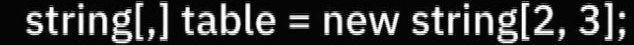
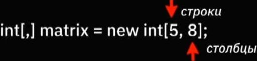
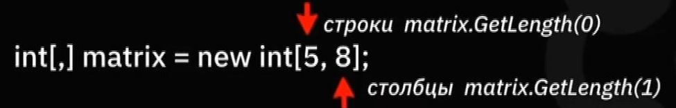
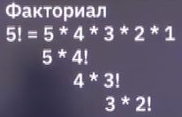

###  Sh_L4_P1.mkv 278,9 MiB MyLocations
### Тема: Двумерные массивы
  

### 1) Как задаются 2 мерные массивы (2мм), синтаксис.

<details>
<summary></summary>




### возможна замена использованием метода - GetLength


</details>


### 2) Схема расположения элементов 2мм  

<details>
<summary></summary>

```javascript

string[,] table = new string[2,5];
table[0,0] table[0,1] table[0,2]... table[0,4]
table[1,0] table[1,1] table[1,2]... table[1,4]

```
</details>

### 3) Как обратиться к элементу 2мм 

<details>
<summary></summary>

```javascript

table[1,2] = "слово";

```
</details>


### 4) Пример синтаксиса вывода данных элементов массива 

<details>
<summary></summary>

```javascript

for(int rows = 0; rows < 2; rows++ ) // цикл который считывает элементы по  верктору строк
{
     for (int columns = 0; columns < 5; columns++) // цикл который считывает элементы по верктору столбцов
    {
        Console.WriteLine($"-{table[rows, columns]}-"); // данный код выводит в консоль 
                                                        // значения элементов массива 
                                                        //  (используется метод интерполяции)
    }
}


```
</details>


 


### 5) Пример создания метода вывода данных массива (содержащий в теле этого  метода  предыдущий пример  с добавлением использования метода GetLength) 

<details>
<summary></summary>

```javascript

void PrintArray(int[,] matr) // Создаем метод
 {

 for (int i = 0; i < matr.GetLength(0); i++) // i считывает в строчном напрвлении, используем новый функционал matrix.GetLength(0) (данная конструкция с использование 0 в скобках выводит данные матрицы в строчном направлении)
 {
    for (int j = 0; j < matr.GetLength(1); j++) // j считывает по-столбцам, используем новый функционал matrix.GetLength(0) (данная конструкция с использование 1 в скобках выводит данные матрицы по столбцам)
    {
        Console.Write($"{matr[i, j]} "); // пробел между фиг.скобой и закрывающими прямыми ковычками используем для выводу через пробел
    }
    Console.WriteLine(); // используем для вывода каждой следующей строки вывода с новой строки
 }

 }

 int[,] matrix = new int[3, 4]; // задаем параметры массива (колличество строк "3" и колличество сторбцов "4")
 PrintArray(matrix); // вызываем метод аргументом которого вызывается матрица matrix


```
</details>


### 6) Пример создания метода заполнения 2мм случайными цифрами (с использованием функции Ragdom) и всесте с ним метода вывода данных массива  


<details>
<summary></summary>

```javascript

void PrintArray(int[,] matr) // Создаем метод
 {

 for (int i = 0; i < matr.GetLength(0); i++) // i считывает в строчном напрвлении, используем новый функционал matrix.GetLength(0) (данная конструкция с использование 0 в скобках выводит данные матрицы в строчном направлении)
 {
    for (int j = 0; j < matr.GetLength(1); j++) // j считывает по-столбцам, используем новый функционал matrix.GetLength(1) (данная конструкция с использование 1 в скобках выводит данные матрицы по столбцам)
    {
        Console.Write($"{matr[i, j]} "); // пробел между фиг.скобой и закрывающими прямыми ковычками используем для выводу через пробел
    }
    Console.WriteLine(); // используем для вывода каждой следующей строки вывода с новой строки
 }

 }
 void FillArray(int[,] matr) // создаем метод заполнения матрицы
 {
    for(int i = 0; i < matr.GetLength(0); i++) // i считывает в строчном напрвлении, используем новый функционал matrix.GetLength(0) (данная конструкция с использование 0 в скобках выводит данные матрицы в строчном направлении)
 {
    for(int j = 0; j < matr.GetLength(1); j++)  // j считывает по-столбцам, используем новый функционал matrix.GetLength(0) (данная конструкция с использование 1 в скобках выводит данные матрицы по столбцам)

 {
    matr[i,j] = new Random().Next(1,10); // обращаясь на каждом витке цикла последоваетельно к конкретному элементу заполляем таким образом матрицу с помощью генератора случайных чисел
 }
 }  
 }
 int[,] matrix = new int[3, 4]; // создаем 2мм 
 PrintArray(matrix); // вызываем метод вывода элементов  аргументом которого вызывается 
 // матрица (элементы которой пустые) matrix  
 Console.WriteLine(); // разделяем пустой строкой данные вывода не заполненной матрицы 
 // и данные дальнейшего вывод заполненной  
 FillArray(matrix); // вызываем метод заполения элементов матрицы (данными генератора случайных 
 // чисел)  аргументом которого вызывается матрица matrix (элементы которой пустые)   
  PrintArray(matrix); // вызываем метод вывода элементов  аргументом которого вызывается 
 // матрица matrix (элементы которой теперь заполнены)  


```
</details>


### 7) Пример создания метода выводящего копию 2мм элементов образующих своим перриметором замкнутый по контуру рисунок  

<details>
<summary></summary>

```javascript

int[,] pic = new int[,] // пояснение: необязательно указывать количество строчек и столбцов если есть уже данные, например:
 {  
       
{0,0,0,0,0,0,0,0,0,0,0,0,0,0,0,0,0,0,0,0,0,0,0,0,0,0,},
{0,0,0,0,0,0,0,0,0,0,1,1,0,0,0,0,0,0,0,0,0,0,0,0,0,0,},
{0,0,0,0,0,0,0,0,0,1,0,0,1,0,0,0,0,0,0,0,0,0,0,0,0,0,},
{0,0,0,0,0,0,0,0,0,1,0,0,1,0,0,0,0,0,0,0,0,0,0,0,0,0,},
{0,0,0,0,0,0,0,0,1,0,0,0,1,0,0,0,0,0,0,0,0,0,0,0,0,0,},
{0,0,0,0,0,0,0,0,1,0,0,0,1,0,0,0,0,0,0,0,0,0,0,0,0,0,},
{0,0,0,0,0,0,1,1,0,0,0,1,0,0,0,0,0,0,0,0,0,0,0,0,0,0,},
{0,0,0,1,1,1,0,0,0,0,0,1,0,0,0,0,0,0,0,0,0,0,0,0,0,0,},
{0,1,1,0,0,0,0,0,0,0,0,1,0,0,0,0,0,0,0,0,0,0,0,0,0,0,},
{0,1,0,0,0,0,0,0,0,0,1,0,0,0,0,0,0,0,0,0,0,0,0,0,0,0,},
{0,1,0,0,0,0,0,0,0,1,1,1,1,1,1,1,1,1,1,0,0,0,0,0,0,0,},
{0,1,0,0,0,0,0,0,0,0,0,0,0,0,0,0,0,0,0,1,0,0,0,0,0,0,},
{0,1,0,0,0,0,0,0,0,0,0,0,0,0,0,1,1,1,1,1,0,0,0,0,0,0,},
{0,1,0,0,0,0,0,0,0,0,0,0,0,0,0,0,0,0,0,0,1,0,0,0,0,0,},
{0,1,0,0,0,0,0,0,0,0,0,0,0,0,0,0,0,0,0,0,1,0,0,0,0,0,},
{0,1,0,0,0,0,0,0,0,0,0,0,0,0,0,1,1,1,1,1,0,0,0,0,0,0,},
{0,1,0,0,0,0,0,0,0,0,0,0,0,0,0,0,0,0,0,0,1,0,0,0,0,0,},
{0,1,1,1,1,0,0,0,0,0,0,0,0,0,0,0,0,0,0,0,1,0,0,0,0,0,},
{0,0,0,0,1,1,1,1,0,0,0,0,0,0,0,1,1,1,1,1,0,0,0,0,0,0,},
{0,0,0,0,0,0,0,1,1,1,1,1,1,1,1,0,0,0,0,0,0,0,0,0,0,0,},
{0,0,0,0,0,0,0,0,0,0,0,0,0,0,0,0,0,0,0,0,0,0,0,0,0,0,},
{0,0,0,0,0,0,0,0,0,0,0,0,0,0,0,0,0,0,0,0,0,0,0,0,0,0,},
{0,0,0,0,0,0,0,0,0,0,0,0,0,0,0,0,0,0,0,0,0,0,0,0,0,0,},
 };
void PrintImage(int[,] image)
{
    for (int i = 0;  i < image.GetLength(0); i++)
    {
        for (int j = 0; j < image.GetLength(1); j++)
        {
            // Console.Write($"{image[i, j]} ");
            if(image[i,j] == 0) Console.Write($" ");
            else Console.Write($"+");
        }
        Console.WriteLine();
    }
}

 
 PrintImage(pic);


```
</details>


  


### 8) Пример создания метода заполняющего (закрышивающего) пространство внутри перриметра рисунка  

<details>
<summary></summary>

```javascript

int[,] pic = new int[,] // пояснение: необязательно указывать количество строчек и столбцов если есть уже данные, например:
 {  
       
{0,0,0,0,0,0,0,0,0,0,0,0,0,0,0,0,0,0,0,0,0,0,0,0,0,0,},
{0,0,0,0,0,0,0,0,0,0,1,1,0,0,0,0,0,0,0,0,0,0,0,0,0,0,},
{0,0,0,0,0,0,0,0,0,1,0,0,1,0,0,0,0,0,0,0,0,0,0,0,0,0,},
{0,0,0,0,0,0,0,0,0,1,0,0,1,0,0,0,0,0,0,0,0,0,0,0,0,0,},
{0,0,0,0,0,0,0,0,1,0,0,0,1,0,0,0,0,0,0,0,0,0,0,0,0,0,},
{0,0,0,0,0,0,0,0,1,0,0,0,1,0,0,0,0,0,0,0,0,0,0,0,0,0,},
{0,0,0,0,0,0,1,1,0,0,0,1,0,0,0,0,0,0,0,0,0,0,0,0,0,0,},
{0,0,0,1,1,1,0,0,0,0,0,1,0,0,0,0,0,0,0,0,0,0,0,0,0,0,},
{0,1,1,0,0,0,0,0,0,0,0,1,0,0,0,0,0,0,0,0,0,0,0,0,0,0,},
{0,1,0,0,0,0,0,0,0,0,1,0,0,0,0,0,0,0,0,0,0,0,0,0,0,0,},
{0,1,0,0,0,0,0,0,0,1,1,1,1,1,1,1,1,1,1,0,0,0,0,0,0,0,},
{0,1,0,0,0,0,0,0,0,0,0,0,0,0,0,0,0,0,0,1,0,0,0,0,0,0,},
{0,1,0,0,0,0,0,0,0,0,0,0,0,0,0,1,1,1,1,1,0,0,0,0,0,0,},
{0,1,0,0,0,0,0,0,0,0,0,0,0,0,0,0,0,0,0,0,1,0,0,0,0,0,},
{0,1,0,0,0,0,0,0,0,0,0,0,0,0,0,0,0,0,0,0,1,0,0,0,0,0,},
{0,1,0,0,0,0,0,0,0,0,0,0,0,0,0,1,1,1,1,1,0,0,0,0,0,0,},
{0,1,0,0,0,0,0,0,0,0,0,0,0,0,0,0,0,0,0,0,1,0,0,0,0,0,},
{0,1,1,1,1,0,0,0,0,0,0,0,0,0,0,0,0,0,0,0,1,0,0,0,0,0,},
{0,0,0,0,1,1,1,1,0,0,0,0,0,0,0,1,1,1,1,1,0,0,0,0,0,0,},
{0,0,0,0,0,0,0,1,1,1,1,1,1,1,1,0,0,0,0,0,0,0,0,0,0,0,},
{0,0,0,0,0,0,0,0,0,0,0,0,0,0,0,0,0,0,0,0,0,0,0,0,0,0,},
{0,0,0,0,0,0,0,0,0,0,0,0,0,0,0,0,0,0,0,0,0,0,0,0,0,0,},
{0,0,0,0,0,0,0,0,0,0,0,0,0,0,0,0,0,0,0,0,0,0,0,0,0,0,},
 };
void PrintImage(int[,] image)
{
    for (int i = 0;  i < image.GetLength(0); i++)
    {
        for (int j = 0; j < image.GetLength(1); j++)
        {
            // Console.Write($"{image[i, j]} ");
            if(image[i,j] == 0) Console.Write($" ");
            else Console.Write($"+");
        }
        Console.WriteLine();
    }
}
 void FillImage(int row, int col)
 {
    if(pic[row, col] == 0)
    {
        pic[row, col] = 1;
        FillImage(row - 1, col);
        FillImage(row, col - 1);
        FillImage(row + 1, col);
        FillImage(row, col + 1);
    }
 }
 
 PrintImage(pic);
 FillImage(10, 7);
 PrintImage(pic);

```
</details>


  


### 9) Как называется функция в программировании которая вызываеь сама себя

<details>
<summary></summary>

```javascript

Рекурсия

```
</details>


### 10) Как рекурсия нызывается в математике 

<details>
<summary></summary>

```javascript

Рекуретное соотношение

```
</details>


   


### 11) Что понимают в математике под факториалом. Пример вычисления факториала с использованием рекурсии  

<details>
<summary></summary>

### Произведение чисел от единицы до заданного числа  
   


</details>


  


### 12) Как можно преобразовать действие поиска факториала, для представления в виде функции 

<details>
<summary></summary>

 и   т.д.

</details>


 
 
### 13) Пример функции расчета факториала числа  

<details>
<summary></summary>

```javascript

 double Factorial (double n)
  {
    if (n == 1) return 1;
    else return n * Factorial(n - 1);
  }
  Console.WriteLine(Factorial(3));

```
</details>

